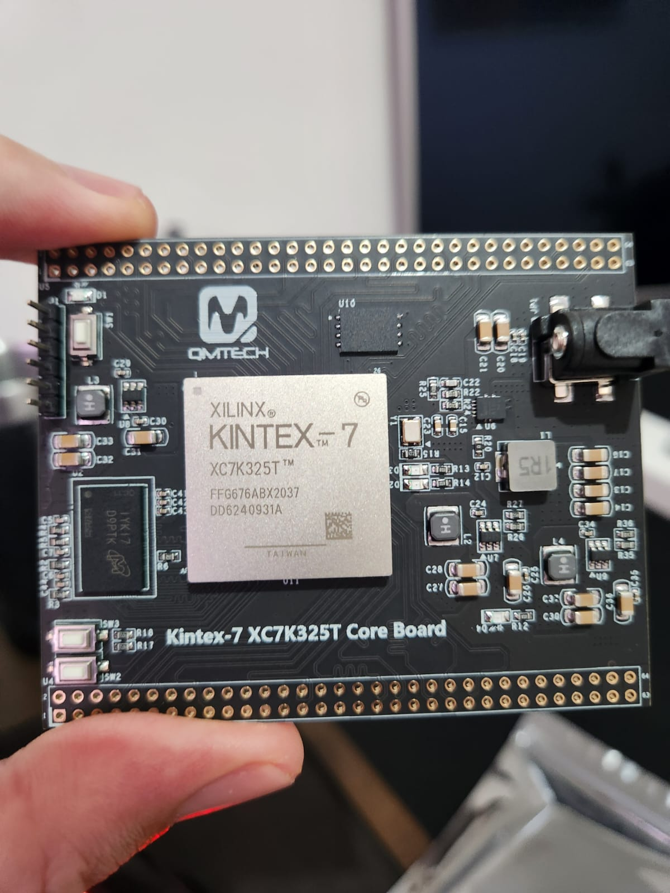
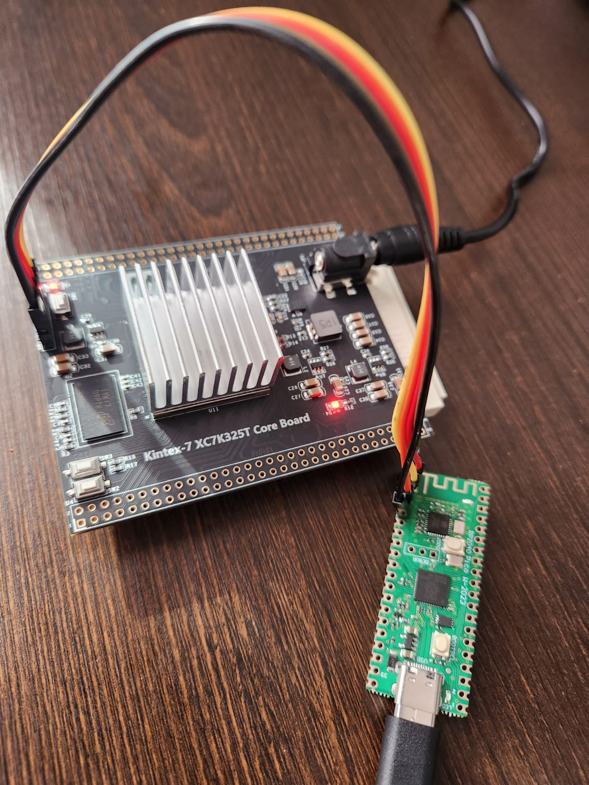
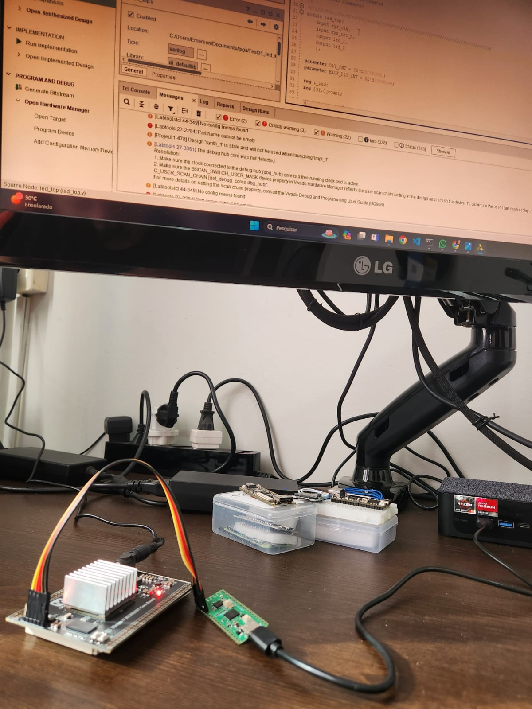

## Core fpga QMTECH_XC7K325T https://github.com/ChinaQMTECH/QMTECH_XC7K325T_CORE_BOARD

## Cabo xilinx jtag baseado no projeto Raspberry Pico based Xilinx Virtual Cable (XVC) https://github.com/kholia/xvc-pico

